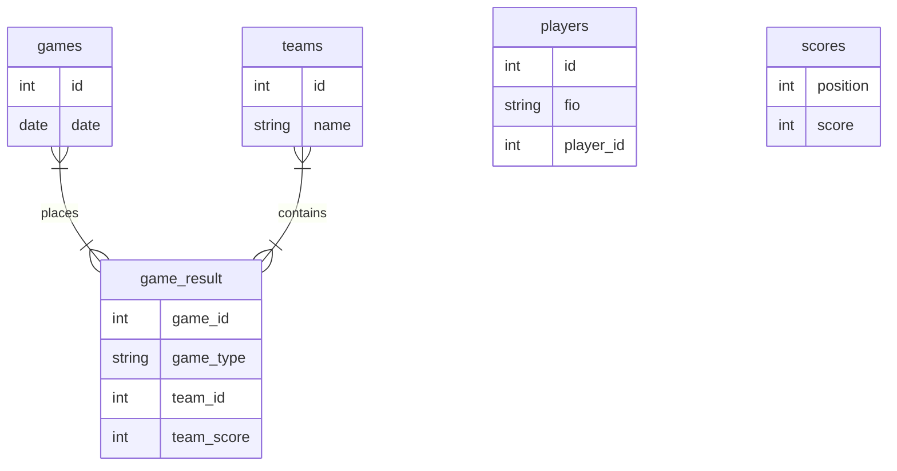

Содержимое:

1. stat.py - основной скрипт.

2. util / parse_maii_to_db.py - скрипт парсер МАИИ.

3. util / data.db - актуальные данные на 30.05.2024 (1373 записи).
4. js / table_main.js - обработчик главной таблицы.
5. js / table_players.js - обработчик таблицы игроков.

#### Структура БД

Команда развёртывания / установки:

    git clone https://github.com/dim5x/statistika.git && cd statistika && chmod +x deploy.sh && sudo ./deploy.sh