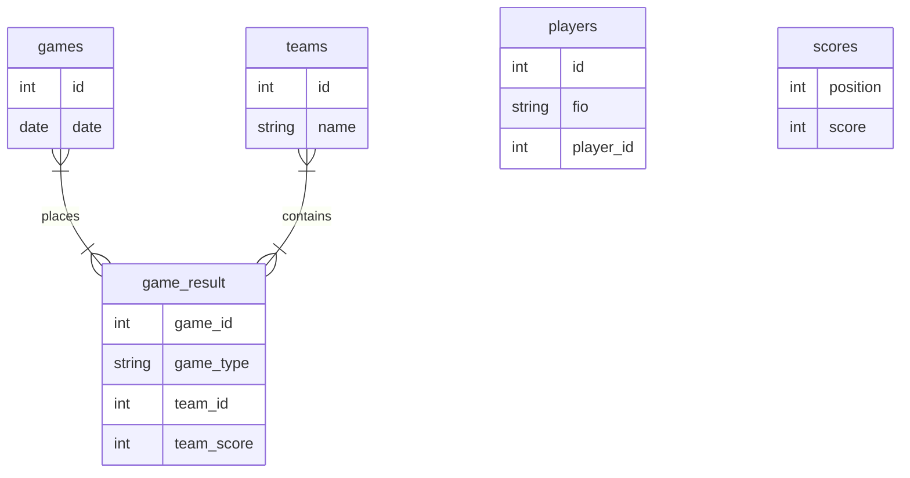

#### Содержимое:
    ┌
    │   .gitignore                          - для указания файлов и каталогов, которые должны быть проигнорированы при коммите.
    │   deploy.sh
    │   readme.md                           - текущий файл, содержащий информацию о проекте.
    │   requirements.txt                    - для указания зависимостей (библиотек и их версий), необходимых для работы проекта.
    │   statistics.pyproj                   - файл конфигурации проекта для Python в Visual Studio. 
    │   statistics.sln                      - для хранения информации о проекте и его компонентах в Visual Studio. 
    │   update.sh                           -  
    │
    ├───.github
    │   └───workflows
    │           static.yml                  -
    ├───cicd
    │       db_initialization.py            -
    │    
    ├───doc
    │       index.html                      -
    │       search.js
    │       Stat.png
    │       statistika.html                 -
    │       _config.yml
    │
    ├───source
    │   │   db_management.py                -
    │   │   statistika.py                   - основной скрипт.
    │   │
    │   ├───static
    │   │   ├───css
    │   │   │   │   base.css                -
    │   │   │   │   game.css                -
    │   │   │   │   index.css               -
    │   │   │   │   login.css               - 
    │   │   │   │   maintable.css           -
    │   │   │   │   modal.css               -  
    │   │   │   │   player.css              -
    │   │   │   │   score.css               -
    │   │   │   │   season.css              -
    │   │   │   │
    │   │   │   └───out
    │   │   │           tabulator.min.css   - минимизированный файл стилей CSS для библиотеки Tabulator.
    │   │   │
    │   │   ├───img
    │   │   │       favicon-32x32.png       - иконка, которая используется веб-сайтами для отображения во вкладке браузера.
    │   │   │       404.png                 - для страницы 404.
    │   │   │
    │   │   └───js
    │   │       │   check_packets.js        -
    │   │       │   modal.js                -
    │   │       │   table_main.js           - обработчик главной таблицы.
    │   │       │   table_players.js        - обработчик таблицы игроков.
    │   │       │   table_teams.js          -
    │   │       │
    │   │       └───out
    │   │               jquery-3.6.0.min.js - минимизированный файл библиотеки jQuery.
    │   │               tabulator.min.js    - файл библиотеки Tabulator, которая используется для создания интерактивных таблиц.
    │   │
    │   └───templates
    │           404.html                    -
    │           add_game.html
    │           add_player.html
    │           add_score.html
    │           add_team.html               -
    │           base.html
    │           index.html
    │           login.html
    │           main_table.html             -
    │
    ├───tests
    │       test_app.py                     -
    │
    └───util
        │   data.db                         - актуальные данные на 30.05.2024 (1373 записи).
        │   parsing_maii_to_db.py           - скрипт парсер МАИИ.
        │
        └───sql
                teams_questions.txt
                teams_rating.txt

#### Структура БД:

#### Структура проекта (в png): 

(а здесь в формате холста Obsidian: https://www.sharecanvas.io/p/stat )

#### Команда развёртывания / установки:

    git clone https://github.com/dim5x/statistika.git && cd statistika && chmod +x deploy.sh && sudo ./deploy.sh
